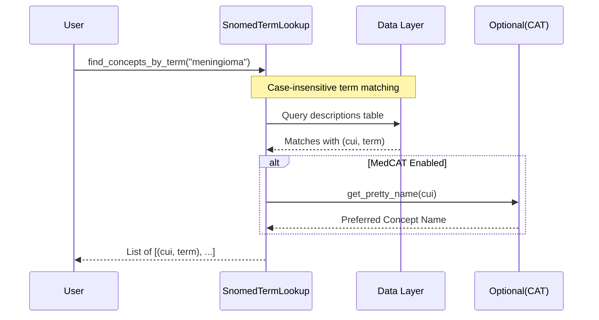

# Basic Term Lookup Workflow

```mermaid
sequenceDiagram
    participant User
    participant Searcher as SnomedTermLookup
    participant DataFrame as Data Layer
    participant MedCAT as Optional(CAT)

    User->>Searcher: find_concepts_by_term("meningioma")

    Note over Searcher,DataFrame: Case-insensitive term matching

    Searcher->>DataFrame: Query descriptions table
    DataFrame-->>Searcher: Matches with (cui, term)

    alt MedCAT Enabled
        Searcher->>MedCAT: get_pretty_name(cui)
        MedCAT-->>Searcher: Preferred Concept Name
    end

    Searcher-->>User: List of [(cui, term), ...]
```
