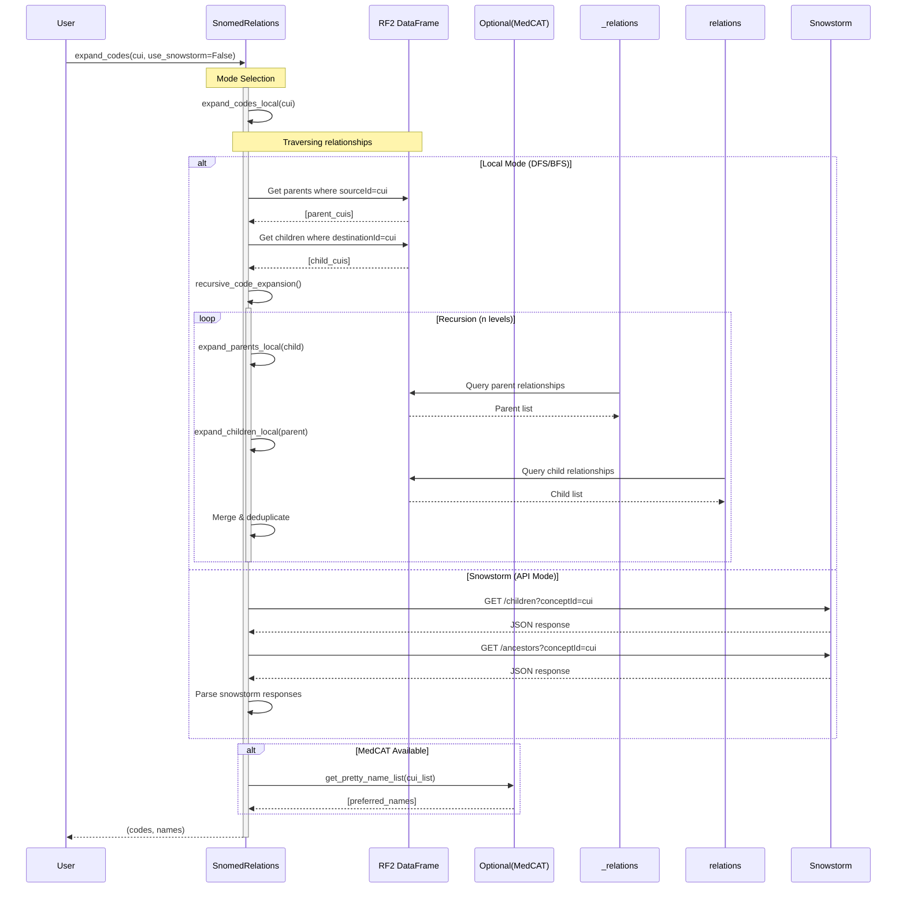

# Concept Hierarchy Expansion Workflow

```mermaid
sequenceDiagram
    participant User
    participant Relations as SnomedRelations
    participant DF as RF2 DataFrame
    participant MedCAT as Optional(MedCAT)

    User->>Relations: expand_codes(cui, use_snowstorm=False)

    Note over Relations: Mode Selection

    activate Relations
    Relations->>Relations: expand_codes_local(cui)

    Note over Relations,DF: Traversing relationships

    alt Local Mode (DFS/BFS)
        Relations->>DF: Get parents where sourceId=cui
        DF-->>Relations: [parent_cuis]

        Relations->>DF: Get children where destinationId=cui
        DF-->>Relations: [child_cuis]

        Relations->>Relations: recursive_code_expansion()
        activate Relations
        loop Recursion (n levels)
            Relations->>Relations: expand_parents_local(child)
           _relations->>DF: Query parent relationships
            DF-->>_relations: Parent list

            Relations->>Relations: expand_children_local(parent)
            relations->>DF: Query child relationships
            DF-->>relations: Child list

            Relations->>Relations: Merge & deduplicate
        end
        deactivate Relations

    else Snowstorm (API Mode)
        Relations->>Snowstorm: GET /children?conceptId=cui
        Snowstorm-->>Relations: JSON response

        Relations->>Snowstorm: GET /ancestors?conceptId=cui
        Snowstorm-->>Relations: JSON response

        Relations->>Relations: Parse snowstorm responses
    end

    alt MedCAT Available
        Relations->>MedCAT: get_pretty_name_list(cui_list)
        MedCAT-->>Relations: [preferred_names]
    end

    Relations-->>User: (codes, names)
    deactivate Relations
```
