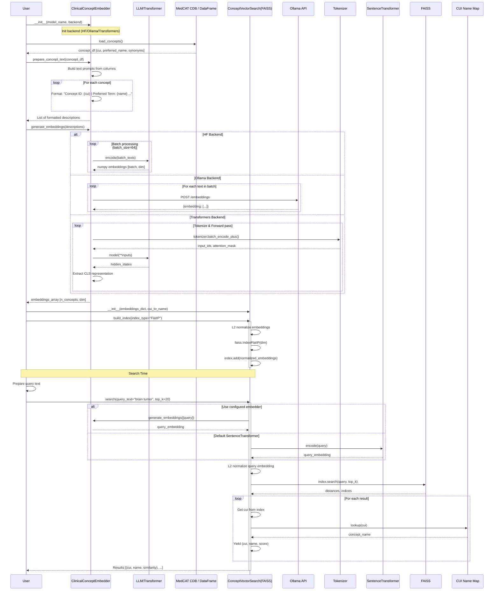

# LLM Embedding & Similarity Search Workflow

```mermaid
sequenceDiagram
    participant User
    participant Embedder as ClinicalConceptEmbedder
    participant Model as LLM/Transformer
    participant CDB as MedCAT CDB / DataFrame
    participant Index as ConceptVectorSearch(FAISS)

    User->>Embedder: __init__(model_name, backend)
    Note over Embedder: Init backend (HF/Ollama/Transformers)

    User->>CDB: load_concepts()
    CDB-->>User: concept_df [cui, preferred_name, synonyms]

    User->>Embedder: prepare_concept_text(concept_df)
    activate Embedder
    Embedder->>Embedder: Build text prompts from columns

    loop For each concept
        Embedder->>Embedder: Format: "Concept ID: {cui} | Preferred Term: {name} ..."
    end

    Embedder-->>User: List of formatted descriptions

    User->>Embedder: generate_embeddings(descriptions)
    activate Embedder

    alt HF Backend
        loop Batch processing (batch_size=64)
            Embedder->>Model: encode(batch_texts)
            Model-->>Embedder: numpy embeddings [batch, dim]
        end

    else Ollama Backend
        loop For each text in batch
            Embedder->>Ollama API: POST /embeddings
            Ollama API-->>Embedder: {embedding: [...]}
        end

    else Transformers Backend
        loop Tokenize & Forward pass
            Embedder->>Tokenizer: tokenizer.batch_encode_plus()
            Tokenizer-->>Embedder: input_ids, attention_mask

            Embedder->>Model: model(**inputs)
            Model-->>Embedder: hidden_states

            Embedder->>Embedder: Extract CLS representation
        end
    end

    Embedder-->>User: embeddings_array [n_concepts, dim]

    User->>Index: __init__(embeddings_dict, cui_to_name)

    User->>Index: build_index(index_type="FlatIP")
    activate Index
    Index->>Index: L2 normalize embeddings

    Index->>Index: faiss.IndexFlatIP(dim)

    Index->>Index: index.add(normalized_embeddings)
    deactivate Index

    Note over User,Index: Search Time

    User->>User: Prepare query text

    User->>Index: search(query_text="brain tumor", top_k=20)
    activate Index

    alt Use configured embedder
        Index->>Embedder: generate_embeddings([query])
        Embedder-->>Index: query_embedding

    else Default SentenceTransformer
        Index->>SentenceTransformer: encode(query)
        SentenceTransformer-->>Index: query_embedding
    end

    Index->>Index: L2 normalize query embedding

    Index->>FAISS: index.search(query, top_k)
    FAISS-->>Index: distances, indices

    loop For each result
        Index->>Index: Get cui from index
        Index->>CUI Name Map: lookup(cui)
        CUI Name Map-->>Index: concept_name
        Index->>Index: Yield (cui, name, score)
    end

    Index-->>User: Results [(cui, name, similarity), ...]
    deactivate Index
```
