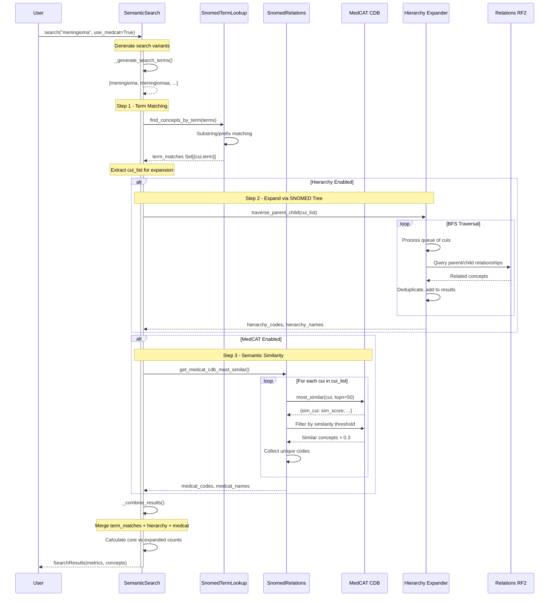

# Combined Semantic Expansion Workflow

```mermaid
sequenceDiagram
    participant User
    participant Searcher as SemanticSearch
    participant TermLookup as SnomedTermLookup
    participant Relations as SnomedRelations
    participant MedCAT as MedCAT CDB
    participant Hierarchy as Hierarchy Expander

    User->>Searcher: search("meningioma", use_medcat=True)

    Note over Searcher: Generate search variants

    activate Searcher
    Searcher->>Searcher: _generate_search_terms()
    Searcher-->>Searcher: [meningioma, meningiomaa, ...]

    Note over Searcher: Step 1 - Term Matching

    Searcher->>TermLookup: find_concepts_by_term(terms)
    TermLookup->>TermLookup: Substring/prefix matching
    TermLookup-->>Searcher: term_matches Set[(cui,term)]

    Note over Searcher: Extract cui_list for expansion

    alt Hierarchy Enabled
        Note over Searcher,Hierarchy: Step 2 - Expand via SNOMED Tree

        Searcher->>Hierarchy: traverse_parent_child(cui_list)

        loop BFS Traversal
            Hierarchy->>Hierarchy: Process queue of cuis
           Hierarchy->> Relations RF2: Query parent/child relationships
            Relations RF2-->>Hierarchy: Related concepts

            Hierarchy->>Hierarchy: Deduplicate, add to results
        end

        Hierarchy-->>Searcher: hierarchy_codes, hierarchy_names
    end

    alt MedCAT Enabled
        Note over Searcher,MedCAT: Step 3 - Semantic Similarity

        Searcher->>Relations: get_medcat_cdb_most_similar()

        loop For each cui in cui_list
            Relations->>MedCAT: most_similar(cui, topn=50)
            MedCAT-->>Relations: {sim_cui: sim_score, ...}

            Relations->>MedCAT: Filter by similarity threshold
            MedCAT-->>Relations: Similar concepts > 0.3

            Relations->>Relations: Collect unique codes
        end

        Relations-->>Searcher: medcat_codes, medcat_names
    end

    Searcher->>Searcher: _combine_results()

    Note over Searcher: Merge term_matches + hierarchy + medcat

    Searcher->>Searcher: Calculate core vs expanded counts
    Searcher-->>User: SearchResults(metrics, concepts)

    deactivate Searcher
```
